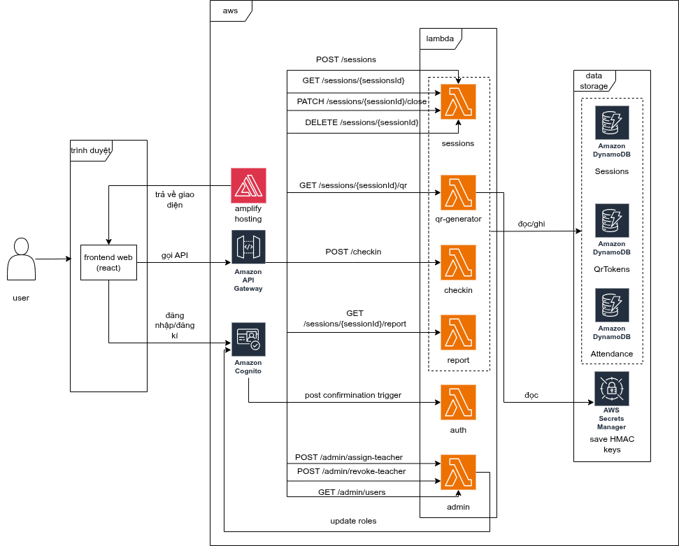

# Application Architecture

## 1. Pattern: Router → Handler → Repository

Ta sử dụng Layered Architecture

```
API Gateway Event
       │
       ▼
  index.ts          ← Router: nhận event, phân nhánh theo method + path
       │
       ▼
  handler.ts        ← Business Logic: validate, kiểm tra quyền, orchestrate
       │
       ▼
  repository.ts     ← Data Access: tương tác DynamoDB (PutItem, GetItem, ...)
```

| Tầng           | File            | Trách nhiệm                                                                                      |
| -------------- | --------------- | ------------------------------------------------------------------------------------------------ |
| **Router**     | `index.ts`      | Nhận `APIGatewayProxyEvent` từ API Gateway, đọc `httpMethod` + `path`, gọi đúng handler function |
| **Handler**    | `handler.ts`    | Validate input, đọc `teacherId`/`studentId` từ JWT context, kiểm tra quyền, gọi repository       |
| **Repository** | `repository.ts` | Thực thi DynamoDB commands (`PutItem`, `GetItem`, `UpdateItem`, `DeleteItem`, `Query`)           |
| **Types**      | `types.ts`      | TypeScript interfaces và enums dùng chung trong module                                           |

## 2. Kiến trúc triển khai trên AWS

Sơ đồ dưới đây mô phỏng kiến trúc Serverless trên AWS



## 3. Cấu trúc thư mục

```
src/
├── functions/
│   ├── auth/
│   │   └── index.ts                 # Cognito Post Confirmation Trigger
│   ├── session/
│   │   ├── index.ts                 # Router
│   │   ├── handler.ts               # Business Logic
│   │   ├── repository.ts            # DynamoDB layer
│   │   └── types.ts
│   ├── qr-generator/
│   │   ├── index.ts
│   │   ├── handler.ts
│   │   └── types.ts
│   ├── checkin/
│   │   ├── index.ts
│   │   ├── handler.ts
│   │   └── repository.ts
│   ├── report/
│   │   ├── index.ts
│   │   ├── handler.ts
│   │   └── repository.ts
│   └── admin/
│       ├── index.ts
│       └── handler.ts
└── shared/
    ├── response.ts                  # Helper tạo HTTP response chuẩn
    ├── errors.ts                    # Custom error classes
    └── logger.ts                    # CloudWatch logging wrapper
```

## 4. Quy tắc thiết kế

- **`teacherId` / `studentId` lấy từ JWT**, không từ request body → tránh giả mạo định danh.
- **Tên bảng DynamoDB** inject qua Lambda environment variable, không hard-code.
- **HMAC secret key** lưu trong AWS Secrets Manager, không lưu trong env var.
- **`ExpressionAttributeNames`** phải dùng cho DynamoDB attribute `status` (reserved keyword).
