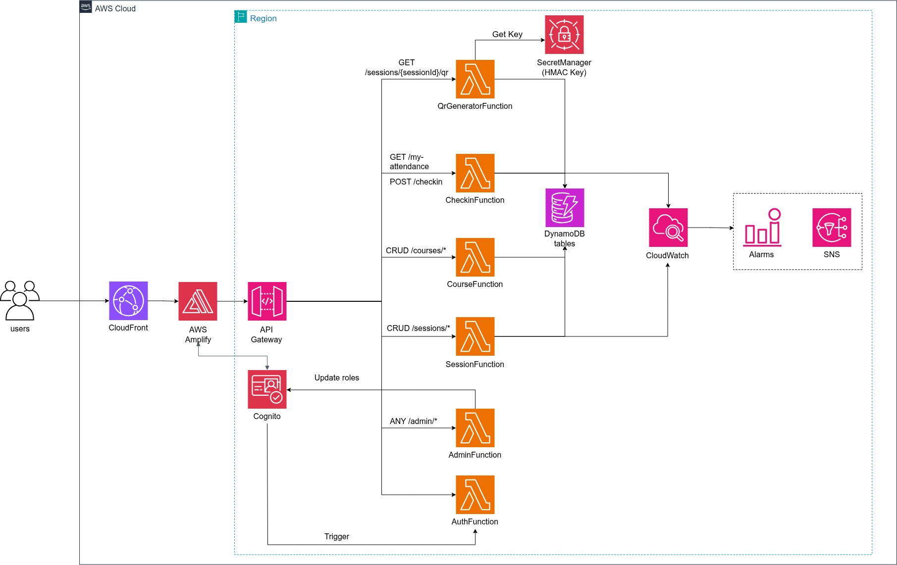

# Application Architecture

## 1. Pattern: Index → Handler → Service → Repository

Ta sử dụng **Layered Architecture** 

```
API Gateway Event
       │
       ▼
  indexes/         ← Entry Point: nhận event, phân nhánh theo method + path
       │
       ▼
  handlers/        ← Request Layer: parse body, validate (Zod), kiểm tra quyền, trả về Response
       │
       ▼
  services/        ← Business Logic: orchestrate, xử lý nghiệp vụ, ném typed errors
       │
       ▼
  repositories/    ← Data Access: tương tác DynamoDB / Cognito (PutItem, GetItem, ...)
```

| Tầng               | Thư mục          | Trách nhiệm                                                                                                 |
| ------------------ | ---------------- | ----------------------------------------------------------------------------------------------------------- |
| **Entry Point**    | `indexes/`       | Nhận `APIGatewayProxyEventV2` từ API Gateway, đọc `method` + `path`, điều phối sang đúng Handler           |
| **Handler**        | `handlers/`      | Parse `event.body`, validate bằng Zod, lấy userId từ JWT, gọi Service, trả về Response                     |
| **Service**        | `services/`      | Chứa toàn bộ Business Logic. Ném `AppError` (NotFoundError, ForbiddenError...) khi vi phạm nghiệp vụ        |
| **Repository**     | `repositories/`  | Thực thi DynamoDB / Cognito commands. Giấu hoàn toàn chi tiết kỹ thuật của AWS SDK khỏi tầng trên           |
| **Shared**         | `shared/`        | Các tiện ích dùng chung: `errors.ts`, `response.ts`, `permissions.ts`, `logger.ts`, `models.ts`, `schemas.ts` |

## 2. Cấu trúc thư mục (Directory Structure)

Dự án được tổ chức theo mô hình Monorepo, bao gồm cả Frontend, Backend và các script hỗ trợ.

```
qr-attendance/
├── backend/         # Mã nguồn Backend (AWS SAM, Node.js, TypeScript)
│   ├── samconfig.toml     # Cấu hình deploy cho SAM CLI
│   ├── template.yaml      # Định nghĩa CloudFormation resources (IaC)
│   └── src/               # Thư mục chứa code logic chính
│       ├── indexes/       # Entry point của Lambda
│       │   ├── adminIndex, authIndex, checkinIndex, courseIndex, qrGeneratorIndex, reportIndex, sessionIndex
│       ├── handlers/      # Request/Response layer (Controller)
│       │   ├── adminHandler, authHandler, checkinHandler, courseHandler, qrGeneratorHandler, reportHandler, sessionHandler
│       ├── services/      # Business Logic layer
│       │   ├── adminService, authService, checkinService, courseService, qrGeneratorService, reportService, sessionService
│       ├── repositories/  # Data Access layer (DynamoDB / Cognito)
│       │   ├── checkinRepository, courseRepository, qrGeneratorRepository, reportRepository, sessionRepository
│       └── shared/        # Các tiện ích dùng chung
│           ├── errors.ts, logger.ts, models.ts, permissions.ts, response.ts, schemas.ts
│
├── frontend/        # Mã nguồn Frontend (React, Vite, Tailwind CSS)
│   ├── src/
│   │   ├── components/    # Reusable UI components
│   │   ├── pages/         # Các trang (Dashboard, Login, Scan...)
│   │   └── api/           # Gọi API đến Backend
│   ├── package.json
│   └── vite.config.ts
│
├── scripts/         # Các script hỗ trợ tự động hoá
│   └── create_admin.sh    # Script tự động lấy config AWS và tạo tài khoản Admin
│
└── docs/            # Tài liệu kiến trúc và hướng dẫn (OVERVIEW, ARCHITECTURE)
```

## 3. Kiến trúc triển khai trên AWS

Sơ đồ dưới đây mô phỏng kiến trúc Serverless trên AWS



