# Software Requirements Specification (SRS)

## 1. Yêu cầu chức năng (Functional Requirements)

| Mã | Mô tả yêu cầu |
|----|--------------|
| FR-01 | Hệ thống cho phép người dùng tự đăng ký tài khoản bằng email |
| FR-02 | Hệ thống xác thực người dùng bằng email và mật khẩu, trả về JWT token |
| FR-03 | Hệ thống phân quyền người dùng theo nhóm: `STUDENT`, `TEACHER`, `ADMIN` |
| FR-04 | Giảng viên có thể tạo, đóng và xóa phiên điểm danh (session) |
| FR-05 | Hệ thống sinh QR Code động, token thay đổi mỗi 30–60 giây |
| FR-06 | Mỗi QR token chỉ sử dụng được một lần duy nhất |
| FR-07 | Sinh viên điểm danh bằng cách quét QR Code |
| FR-08 | Hệ thống ngăn chặn điểm danh 2 lần trong cùng một phiên |
| FR-09 | Giảng viên xem và xuất báo cáo điểm danh ra file Excel (bao gồm thông tin sinh viên, thời gian, trường, khoa, ngành) |
| FR-10 | Admin xem danh sách toàn bộ tài khoản trong hệ thống |
| FR-11 | Admin cấp và thu hồi quyền Giảng viên (`TEACHER`) cho tài khoản bất kỳ |
| FR-12 | Giảng viên có thể thiết lập thời gian hẹn giờ (1 - 180 phút) để tự động đóng phiên điểm danh |
| FR-13 | Giảng viên có thể xem danh sách các phiên điểm danh do mình quản lý |
| FR-14 | Admin có thể xóa tài khoản người dùng, nhưng không được phép xóa tài khoản của Admin khác |
| FR-15 | Hệ thống cung cấp cơ chế khôi phục mật khẩu thông qua mã xác nhận gửi tới email |
| FR-16 | Người dùng (Sinh viên, Giảng viên, Admin) có thể cập nhật hồ sơ cá nhân (Họ tên, Trường, Khoa, Ngành) |
| FR-17 | Giảng viên có thể tạo, xem, xoá môn học (Course Management) |

## 2. Use Cases

### 2.1 Use Cases của Giảng viên

| Mã | Use Case | Mô tả | Điều kiện tiên quyết | Kết quả | FR liên quan |
|----|----------|-------|----------------------|---------|-------------|
| UC-T01 | Đăng ký tài khoản | Giảng viên tạo tài khoản mới | Chưa có tài khoản | Tài khoản tạo với quyền `STUDENT`; Admin nâng lên `TEACHER` | FR-01, FR-03 |
| UC-T02 | Đăng nhập | Giảng viên đăng nhập bằng email + mật khẩu | Đã có tài khoản `TEACHER` | Nhận JWT token | FR-02 |
| UC-T03 | Tạo phiên điểm danh | Giảng viên tạo session mới (tùy chỉnh thời lượng 1 - 180 phút) | Đã đăng nhập (TEACHER) | Nhận `sessionId`, trạng thái `ACTIVE` | FR-04, FR-12 |
| UC-T04 | Lấy QR Code | Giảng viên lấy QR Code mới nhất để chiếu lên bảng | Session đang `ACTIVE` | Nhận token ngắn hạn (30–60s) | FR-05 |
| UC-T05 | Đóng phiên điểm danh | Giảng viên kết thúc buổi điểm danh | Session đang `ACTIVE` | Session chuyển `CLOSED`, dừng sinh QR | FR-04 |
| UC-T06 | Xem danh sách điểm danh | Giảng viên xem báo cáo sau khi đóng phiên | Đã đóng session | Danh sách sinh viên | FR-09 |
| UC-T07 | Xuất báo cáo Excel | Giảng viên xuất dữ liệu ra file Excel (.xlsx) | Đã có dữ liệu điểm danh | Tải xuống file Excel | FR-09 |
| UC-T08 | Xóa phiên điểm danh | Giảng viên xóa phiên điểm danh do mình tạo | Đã đăng nhập (TEACHER) | Phiên bị xóa hoàn toàn | FR-07 |
| UC-T09 | Xem danh sách phiên điểm danh | Giảng viên xem tất cả session do mình tạo | Đã đăng nhập (TEACHER) | Danh sách các session | FR-13 |
| UC-T10 | Cập nhật hồ sơ | Giảng viên cập nhật thông tin cá nhân | Đã đăng nhập | Hồ sơ cá nhân được lưu lại | FR-16 |
| UC-T11 | Quên mật khẩu | Giảng viên yêu cầu khôi phục mật khẩu | Chưa đăng nhập, quên mật khẩu | Đổi mật khẩu mới thành công | FR-15 |
| UC-T12 | Tạo môn học | Giảng viên thêm môn học mới | Đã đăng nhập (TEACHER) | Môn học được tạo thành công | FR-17 |
| UC-T13 | Xem danh sách môn học | Giảng viên xem các môn học đã tạo | Đã đăng nhập (TEACHER) | Danh sách môn học (kèm phân trang & tìm kiếm) | FR-17 |
| UC-T14 | Xóa môn học | Giảng viên xóa môn học | Đã đăng nhập (TEACHER), là chủ sở hữu môn học | Môn học bị xóa | FR-17 |

#### Use Case Diagram — Giảng viên

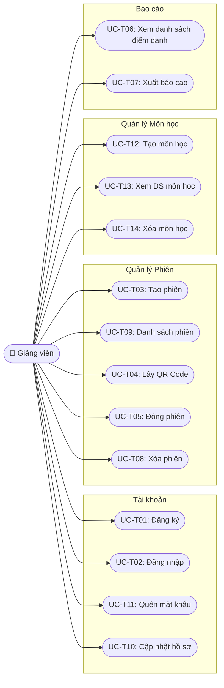

---

### 2.2 Use Cases của Sinh viên

| Mã | Use Case | Mô tả | Điều kiện tiên quyết | Kết quả | FR liên quan |
|----|----------|-------|----------------------|---------|-------------|
| UC-S01 | Đăng ký tài khoản | Sinh viên tạo tài khoản mới | Chưa có tài khoản | Tài khoản được tạo với quyền `STUDENT` | FR-01, FR-03 |
| UC-S02 | Đăng nhập | Sinh viên đăng nhập bằng email + mật khẩu | Đã có tài khoản | Nhận JWT token | FR-02 |
| UC-S03 | Quét QR và điểm danh | Sinh viên quét QR Code đang chiếu → hệ thống gửi token lên API | Đã đăng nhập, session `ACTIVE`, token hợp lệ | Điểm danh thành công | FR-07, FR-06, FR-08 |
| UC-S04 | Xem lịch sử điểm danh | Sinh viên xem các buổi mình đã điểm danh | Đã đăng nhập | Danh sách lịch sử cá nhân | FR-09 |
| UC-S05 | Cập nhật hồ sơ | Sinh viên cập nhật trường, khoa, chuyên ngành | Đã đăng nhập | Hồ sơ cá nhân được lưu lại | FR-16 |
| UC-S06 | Quên mật khẩu | Sinh viên lấy lại mật khẩu qua email | Chưa đăng nhập, quên mật khẩu | Đổi mật khẩu mới thành công | FR-15 |

#### Use Case Diagram — Sinh viên

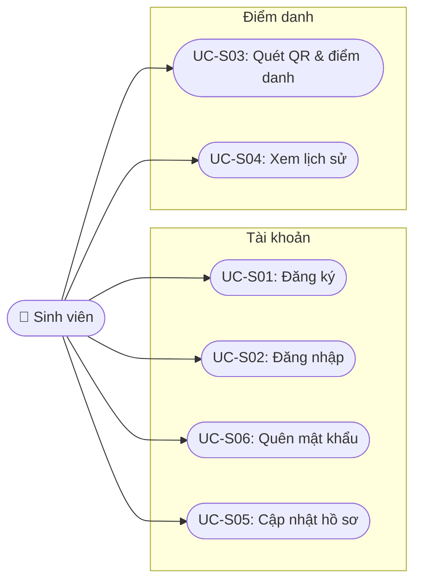

---

### 2.3 Use Cases của Quản trị viên (Admin)

| Mã | Use Case | Mô tả | Điều kiện tiên quyết | Kết quả | FR liên quan |
|----|----------|-------|----------------------|---------|-------------|
| UC-A01 | Đăng nhập Admin | Admin đăng nhập vào hệ thống | Tài khoản nhóm `ADMIN` (tạo sẵn khi deploy) | Nhận JWT token quyền Admin | FR-02 |
| UC-A02 | Xem danh sách người dùng | Admin xem tất cả tài khoản | Đã đăng nhập (ADMIN) | Danh sách email, họ tên, role hiện tại | FR-10 |
| UC-A03 | Cấp quyền Giảng viên | Admin nâng tài khoản `STUDENT` lên `TEACHER` | Đã đăng nhập (ADMIN) | User chuyển sang nhóm `TEACHER` | FR-11 |
| UC-A04 | Thu hồi quyền Giảng viên | Admin hạ `TEACHER` về `STUDENT` | Đã đăng nhập (ADMIN) | User chuyển sang nhóm `STUDENT` | FR-11 |
| UC-A05 | Xóa tài khoản người dùng | Admin xóa user khỏi hệ thống | Đã đăng nhập (ADMIN) | Xóa thành công (trừ phi user cũng là ADMIN) | FR-14 |

#### Use Case Diagram — Admin

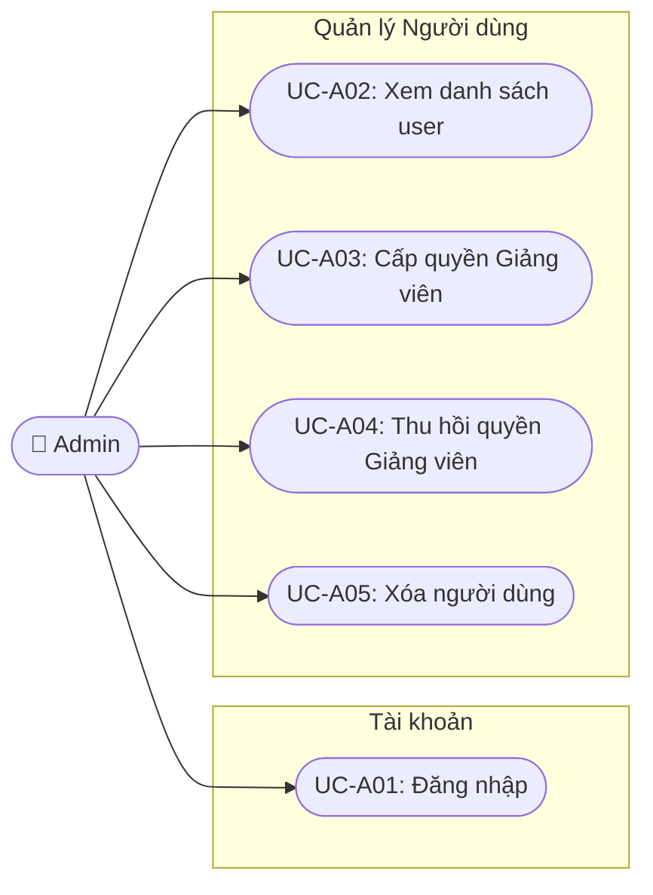

---

### 2.4 Các trường hợp ngoại lệ (Alternative Flows)

| Mã | Tình huống | Nguyên nhân | Phản hồi hệ thống |
|----|-----------|-------------|-------------------|
| UC-F01 | Điểm danh thất bại — Token hết hạn | QR đã xoay sang token mới, token cũ quá TTL | `403 Token expired` |
| UC-F02 | Điểm danh thất bại — Token không hợp lệ | Token giả mạo hoặc đã được dùng trước đó | `403 Invalid token` |
| UC-F03 | Điểm danh thất bại — Đã điểm danh rồi | Sinh viên quét lần 2 trong cùng session | `409 Already checked in` |
| UC-F04 | Điểm danh thất bại — Session đã đóng | Giảng viên đã kết thúc buổi học | `400 Session is closed` |
| UC-F05 | Lấy QR thất bại — Session không tồn tại | `sessionId` sai hoặc đã bị xóa | `404 Session not found` |

## 3. Sequence Diagrams (Luồng nghiệp vụ)

### SD-01: Đăng ký tài khoản (Giảng viên / Sinh viên)

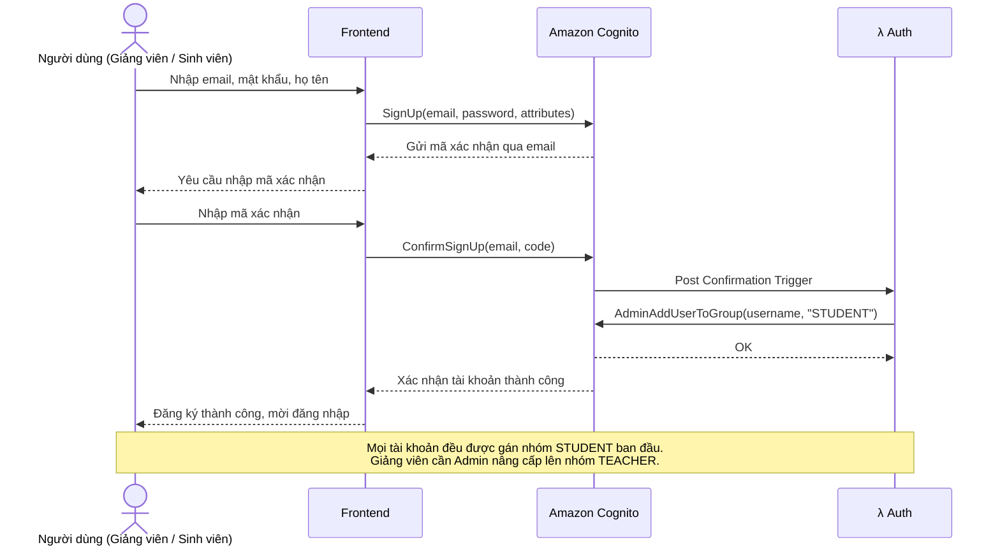

### SD-02: Đăng nhập (Giảng viên / Sinh viên / Admin)

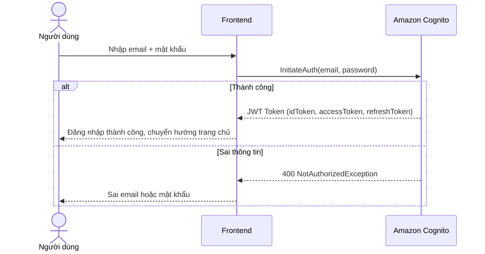

### SD-03: Giảng viên tạo phiên điểm danh

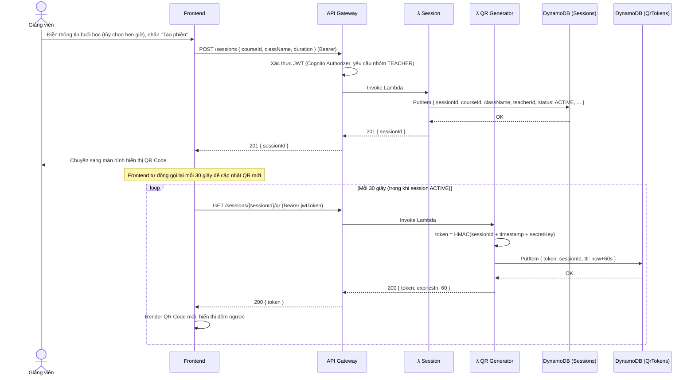

### SD-04: Sinh viên quét QR và điểm danh

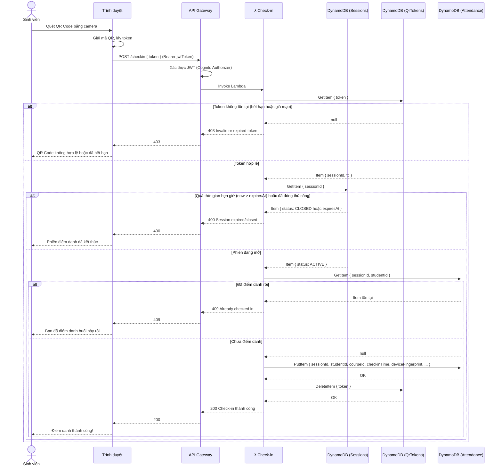

### SD-05: Giảng viên kết thúc phiên và xem báo cáo

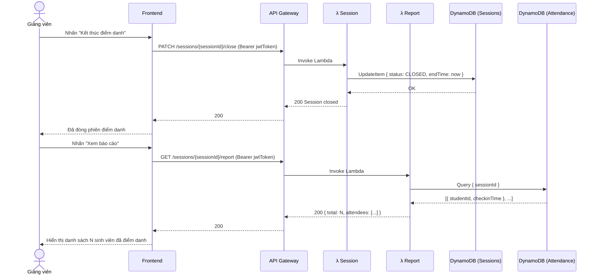

### SD-06: Admin thay đổi role tài khoản

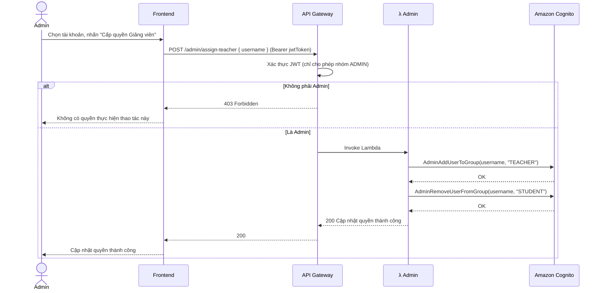

### SD-07: Giảng viên xem lịch sử các phiên đã tạo 

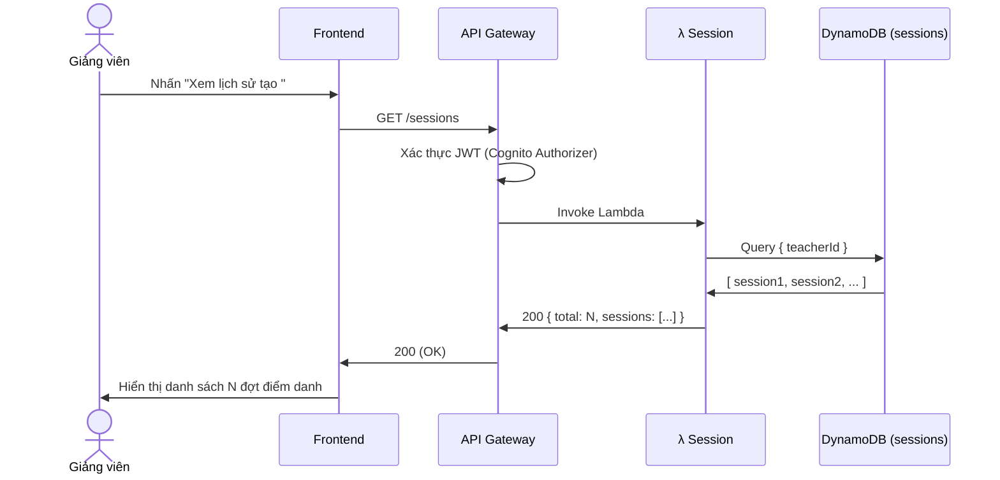

### SD-08: Admin xóa người dùng

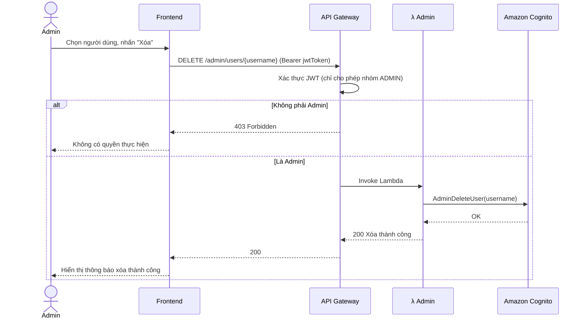

### SD-09: Sinh viên xem lịch sử điểm danh

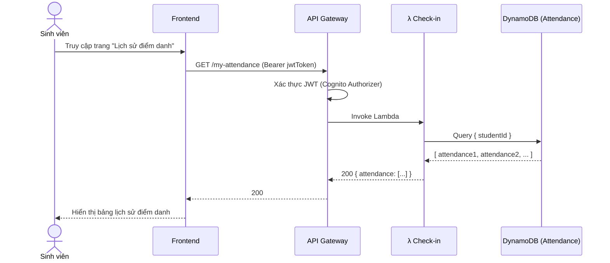

### SD-10: Giảng viên quản lý môn học

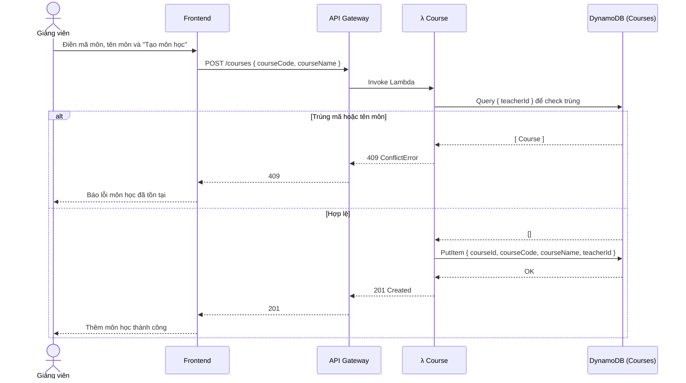
